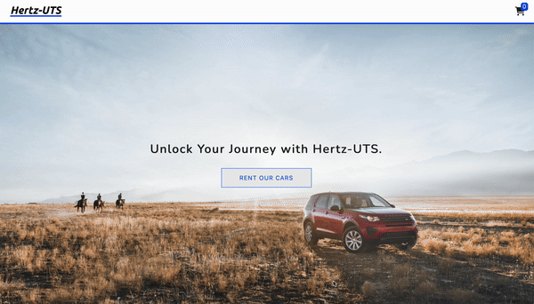

# Online Car Rental Website

Web application designed for the web programming assignment at the University of Technology Sydney (UTS). This system allows users to browse, select, and rent cars with ease, using AJAX and JSON for a dynamic user experience.

🔗 [Demo](https://youtu.be/bgWCCHb-Emk)

## Objectives

- Design and implement a dynamic web application using JSON for data storage and AJAX for asynchronous web server communication.
- Demonstrate the ability to load, parse, and manipulate JSON data within web pages.
- Utilise session management for maintaining state information across different pages of the application.

## Key Functionalities

### Car Browsing

- Dynamically load car data from a JSON file.
- Display cars in a user-friendly tabular format, with options to add available cars to the shopping cart.

### Car Selection

- Check car availability in real-time using AJAX before adding to the shopping cart.
- Use session storage to maintain the state of the shopping cart.

### Shopping Cart

- Allow users to review their selection, adjust rental days, and remove items from the cart.
- Provide a seamless transition to the checkout process.

### Checkout

- Validate the presence of cars in the cart and rental day inputs.
- Collect and validate user delivery details and payment information.
- Display rental history and apply charges accordingly.

## Acknowledgements

Design inspired by the Hertz website.
